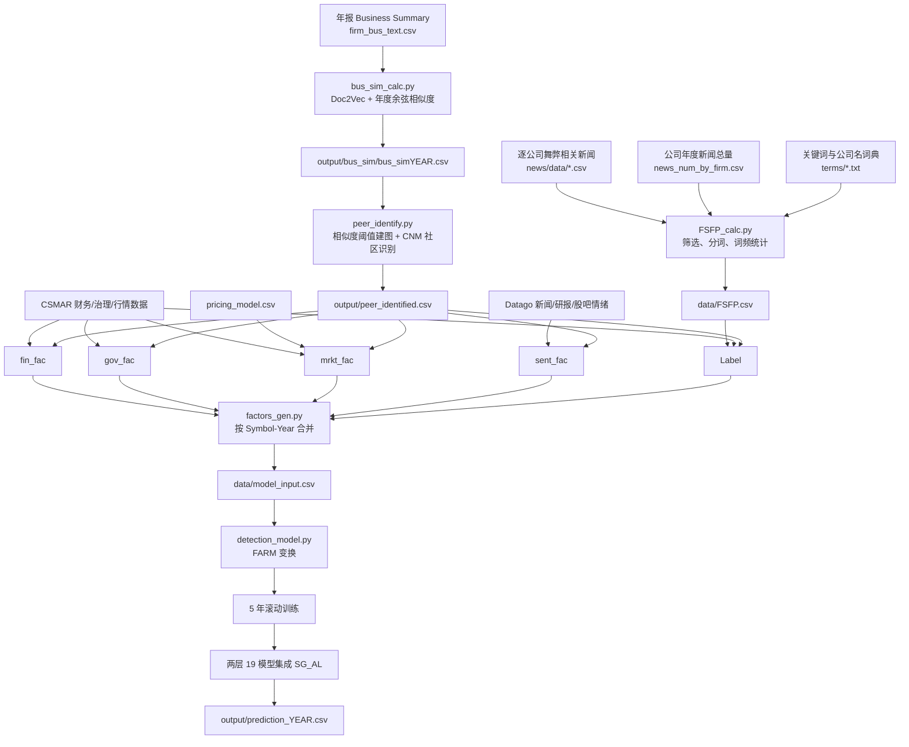

# `mnsc.2023.03604` 代码框架梳理

## 1. 一句话结论

该项目围绕论文 *Unearthing Financial Statement Fraud: Insights from News Coverage Analysis* 展开，主线是：先由新闻构造财务报表舞弊倾向指标 `FSFP`，再由年报业务文本识别同行群组；随后构造财务、治理、市场、舆情四类特征及同行/时序衍生特征，最后通过 FARM 因子变换、滚动窗口和两层分类器集成生成逐年预测。

当前压缩包适合阅读方法框架，但不能按现有脚本直接端到端复现：原始数据库文件未随包提供，而且因子脚本与训练脚本之间存在路径、字段和目标列不一致等问题。第 8 节列出了复现前必须修正的事项。

## 2. 总体数据流



同行识别是四类因子的共同上游，并非仅用于网络图。每个基础变量原则上都会扩展出：

- 原值：`x`
- 同行偏离：`x_peer = x - 同年同 PeerID 的均值`
- 时序变化：`x_time = x(i,t) - x(i,t-1)`

当前实现中有几处没有按上述“原则”正确分组，详见第 8 节。

## 3. 脚本职责与执行顺序

| 顺序 | 脚本 | 核心职责 | 主要输出 |
|---:|---|---|---|
| 0（可选） | `news/fraud_news_collect.py` | 从商业新闻网站按公司抓取舞弊相关新闻正文 | `news/data/{股票代码}.csv` |
| 0（可选） | `news/total_news_count_obtain.py` | 获取每个公司每年的全部新闻数量 | `data/news_num_by_firm.csv` |
| 1 | `FSFP_calc.py` | 筛选同时出现财报词和舞弊词的段落，计算 `FSFP` | `news/news_processed.csv`、`data/FSFP.csv` |
| 2 | `bus_sim_calc.py` | 清洗业务描述，训练 Doc2Vec，逐年计算公司两两余弦相似度 | `data/BusSum_cut.csv`、`model/doc2vec_bus`、年度相似度矩阵 |
| 3 | `peer_identify.py` | 对相似度大于 0.5 的公司连边，以 greedy modularity/CNM 算法识别社区 | `output/peer_identified.csv`、年度网络图 |
| 4 | `factors_gen.py` | 生成四类特征和多个候选标签，合并、填补、缩尾 | `data/model_input.csv` |
| 5 | `detection_model.py` | FARM 变换、5 年滚动训练、两层分类器集成 | `output/prediction_{year}.csv` |
| 6（论文附属分析） | `FSFP_plot.py`、`others/*.py` | 论文图表、阈值和经济价值分析 | 图表及汇总 CSV |

仓库没有总调度脚本，以上步骤需要按顺序单独执行。

## 4. 两个关键上游指标

### 4.1 FSFP 构建

`FSFP_calc.py` 的实际流程如下：

1. 合并 `news/data/*.csv`，以文件名作为 `Symbol`。
2. 新闻正文按段落拆分；仅保留“同一段同时包含至少一个财务报表词和至少一个舞弊词”的新闻。
3. 删除非中文字符，使用 jieba 分词并去停用词。
4. 对每篇新闻计算：
   - `Term_freq`：舞弊词出现次数；
   - `Firm_freq`：公司名称词出现次数；
   - `Firm_num`：该年度上市公司总数；
   - `ATF_IIF = Term_freq × (Firm_freq / Firm_num)`。
5. 公司—年度层面求和，再以公司当年全部新闻量校正：

   `FSFP(i,t) = Σ ATF_IIF(article) / log(News_count(i,t))`

6. 保存 `Symbol, Year, ATF_IIF, News_count, FSFP`。

注意：当 `News_count = 1` 时分母为 0；代码没有在本步骤处理该无穷值。

### 4.2 同行群组构建

`bus_sim_calc.py` 和 `peer_identify.py` 的实际流程如下：

1. 读取 2001—2022 年公司年报中的 `BusSum`。
2. 仅保留中文字符，jieba 分词并去停用词。
3. 对全部公司—年度文本统一训练 300 维 Doc2Vec。
4. 每年计算所有公司两两余弦相似度，复杂度约为 `Σ O(n_t²)`。
5. 每年构造无向图：公司为节点，`0.5 < similarity < 1` 时连边，相似度作为边权。
6. 使用 NetworkX `greedy_modularity_communities` 识别社区，社区编号即 `PeerID`。

`PeerID` 是逐年重新编号的，同一个数字在不同年份不代表同一个稳定行业或群组。因此任何同行均值都必须同时按 `Year` 和 `PeerID` 分组。

## 5. 因子构建

### 5.1 统一的频率和衍生方式

财务、市场和舆情因子均构造 5 套频率：

- `Y`：年度；
- `Q1`、`Q2`、`Q3`、`Q4`：对应季度。

每套基础因子再生成原值、`_peer`、`_time` 三个版本。治理因子仅按年生成，但同样具有这三个版本。

### 5.2 财务因子：15 × 5 × 3 = 225 列

数据源为 CSMAR 资产负债表、利润表、直接法现金流量表和海外业务收入表，仅保留 `Typrep == "A"` 的合并报表。

| 因子 | 代码中的计算式 |
|---|---|
| `Lev` | `A002000000 / A001000000` |
| `FCFR` | `(C001000000 - C002006000) / A001000000` |
| `ROA` | `B002000000 / A001000000` |
| `ROE` | `B002000000 / A003000000` |
| `2yLoss` | 同公司连续两个观测期 `B002000000 < 0` |
| `NCFO` | 同公司连续两个观测期 `C001000000 < 0` |
| `3yGrw` | 同公司 `B001101000.pct_change(periods=2)` |
| `RTR` | `(A001121000 + A002120000) / A001000000` |
| `EIR` | `A001205000 / A003000000` |
| `RIR` | `C001000000 / C002006000` |
| `FSR` | `EarningsProportion` |
| `RR` | `A001121000 / B001101000` |
| `IR` | `A001123000 / B001101000` |
| `CAR` | `A001100000 / A002100000` |
| `FAT` | `B001101000 / A001212000` |

列名示例：`ROA_Q2`、`ROA_Q2_peer`、`ROA_Q2_time`。

年度部分当前代码筛选每年 1 月 1 日的报表，并将年份减 1；季度部分使用当年 3/31、6/30、9/30、12/31。这个年度日期规则需要结合原始 CSMAR 数据核对。

### 5.3 治理因子：12 × 3 = 36 列

| 因子 | 来源或定义 |
|---|---|
| `TopHold` | `ContrshrProportion`，控股股东持股比例 |
| `MHR` | `Mngmhldn`，管理层持股 |
| `IHR` | `InsInvestorProp`，机构投资者持股 |
| `Board` | `Boardsize` |
| `IndDrc` | `IndDirectorRatio` |
| `SOE` | `ContrshrNature` |
| `Dual` | `ConcurrentPosition` |
| `3yIAC` | 直接重命名自 `IsAuditCommitteeSetUp` |
| `3yAFC` | 直接重命名自 `IsChangeFirm` |
| `Top4Aud` | 会计师事务所名称包含普华永道、毕马威、德勤或安永 |
| `3yMC` | 当年是否发生总经理变更 |
| `3yBC` | 当年是否发生董事长变更 |

需要注意：名称带 `3y` 的四个变量在代码中没有显式执行三年滚动计算；其中两个直接来自数据库字段，另外两个只标记当年是否变更。

### 5.4 市场因子：8 × 5 × 3 = 120 列

数据源为 CSMAR 周个股回报、综合周市场回报、资产负债表、利润表，以及外部生成的 `pricing_model.csv`。

| 因子 | 代码中的计算式 |
|---|---|
| `Rtn` | 分组内周收益率 `Wretwd` 之和 |
| `Vol` | 分组内周收益率标准差 |
| `Turnover` | `mean(Wnvaltrd) / mean(Wsmvttl)` |
| `PE` | 期末市值除以平均利润；年度额外将平均利润乘 4 |
| `BM` | 期末权益 `A003000000` / 期末总市值 `Wsmvttl` |
| `Beta` | 分组内个股周收益与市场周收益的相关系数 |
| `FF3` | `pricing_model.csv` 中 `FF3` 的分组均值 |
| `Liu3` | `pricing_model.csv` 中 `Liu3` 的分组均值 |

这里名为 `Beta` 的变量实际是相关系数，并非通常定义的协方差除以市场方差。

### 5.5 舆情因子：3 × 5 × 3 = 45 列

| 因子 | 来源和聚合方式 |
|---|---|
| `NewsSent` | Datago 新闻中情感分数小于 0 的报道篇数 |
| `RepoSent` | Datago 分析师研报中情感分数小于 0 的研报篇数 |
| `GubaSent` | 股吧负面帖子注册用户数之和 |

每个频率内先按公司—年度求和，对缺失年份补 0，再做 `log(count + 1)`，最后生成同行偏离和时序差分。

### 5.6 标签/结果变量：10 列

`Label()` 没有生成名为 `Label` 的唯一训练目标，而是生成多个候选结果变量：

| 列 | 定义 |
|---|---|
| `FSFP_2c` | `FSFP > 0` 为 1，否则为 0 |
| `FSFP_3c` | 0 为 0；非零且不高于非零中位数为 1；高于中位数为 2 |
| `FSFP` | 连续型原值 |
| `Penalty` | 指定违规类型且处罚机构包含“证监会”时为 1 |
| `Restate` | 满足指定对象和类型的财务重述为 1 |
| `NsAudit` | 非“标准无保留意见”为 1 |
| `FSFP_peer` | 上述值减同行均值后再 `shift(1)` |
| `Penalty_peer` | 同上 |
| `Restate_peer` | 同上 |
| `NsAudit_peer` | 同上 |

训练前必须明确选择一个目标，例如 `FSFP_2c` 或 `FSFP_3c`；其余结果变量不应自动进入特征集。

### 5.7 最终合并和预处理

以财务因子表为左表，依次左连接治理、市场、舆情和标签表，然后：

1. 将 `EndDate` 改为 `Year`；
2. 设置 `(Symbol, Year)` 多重索引；
3. 所有列强制转为数值；
4. `±inf → NaN → 0`；
5. 对每一列全样本双侧 1% 缩尾；
6. 输出 `data/model_input.csv`。

按代码静态计算，真正的解释变量共 426 列：

| 特征组 | 基础因子数 | 频率数 | 原值/同行/时序 | 输出列数 |
|---|---:|---:|---:|---:|
| 财务 | 15 | 5 | 3 | 225 |
| 治理 | 12 | 1 | 3 | 36 |
| 市场 | 8 | 5 | 3 | 120 |
| 舆情 | 3 | 5 | 3 | 45 |
| 合计 |  |  |  | **426** |

再加 10 个结果变量和 2 个索引列，CSV 理论上共有 438 列。

## 6. 模型训练流程

### 6.1 FARM 因子变换

`FarmPredict()` 对输入矩阵执行：

1. 全列标准化得到 `Z`；
2. 计算 `C = ZᵀZ / (n-1)` 并做特征分解；
3. 以 `eigenvalue > 1 + sqrt(m/(n-1))` 选择公共因子数 `k`；
4. 公共因子 `F = ZV_k`；
5. 载荷 `B = (FᵀF)^(-1)FᵀZ`；
6. 残差 `U = Z - FB`；
7. 最终使用 `[F, U]` 作为新特征，共 `k + m` 列。

这一步不是降维，而是在原始维数的残差项之外再增加 `k` 个公共因子。

### 6.2 五年滚动窗口

对预测年 `t`：

- 训练期：`t-5` 至 `t-1`；
- 测试期：`t`；
- 当前源码调用 `range(2006, 2022)`，实际只会覆盖 2006—2021；
- 每个年度各输出一个 `output/prediction_t.csv`。

### 6.3 两层集成 `SG_AL`

代码配置 19 个基础学习器：LDA、QDA、两个 Logistic 配置、Naive Bayes、三个树模型、三个前馈神经网络、三个 SVM、KNN、NCA、ITML、LMNN、RUSBoost。

这里描述的是压缩包中 `detection_model.py` 的实际代码行为。用户确认的论文分类器表只包含前 18 个，`RUSBoost` 是源码中的表外追加项。因此当前 `peermeta预测模型.py` 按固定 18 个基础学习器实现，不纳入 `RUSBoost`；任一必需模型失败时也不会用子集继续集成。

第一层：

1. 对每个学习器做 5 折 `cross_val_predict`，得到训练集硬分类结果 `Z_train`；
2. 在完整训练集上拟合，再对测试集预测，得到 `Z_test`；
3. `Z_train/Z_test` 的列数都是 19。

第二层：

1. 再让同一组 19 个学习器以第一层结果为输入；
2. 获得 `P_test`；
3. 对 19 个硬分类结果逐行求均值作为最终分数 `p_mean`；
4. 以学习器间标准差 `p_std` 衡量共识程度。

所谓主动学习阶段会选出标准差最小的前 10% 测试样本，按最近类别生成伪标签并追加到训练集。但函数紧接着执行 `break`，没有用更新后的训练集重新训练，返回的也是更新前的 `p_mean`。因此当前实现中的反馈步骤不影响最终预测。

输出的数值是“第二层硬分类标签的平均值”，不是校准后的概率。

## 7. 当前压缩包的可复现性

包内保留了代码、词典、少量汇总数据、旧日志、Doc2Vec 模型和 `latent_factors.npy`，但以下关键原始文件或中间结果缺失：

- `news/data/*.csv` 新闻正文；
- `data/news_num_by_firm.csv`；
- `data/firm_bus_text.csv`；
- `data/CSMAR_data/**`；
- `data/Datago_data/**`；
- `data/pricing_model.csv`；
- `data/FSFP.csv`；
- `output/peer_identified.csv`；
- `data/model_input.csv`。

README 说明 CSMAR、Datago 和新闻正文需使用者自行合法获取。项目也没有 `requirements.txt` 或锁定环境；根据导入语句至少需要 pandas、NumPy、SciPy、jieba、gensim、scikit-learn、imbalanced-learn、metric-learn、NetworkX、Matplotlib、tqdm，抓取和附属绘图还需要 Selenium、requests、BeautifulSoup、seaborn 等。

## 8. 必须区分“方法意图”和“当前代码行为”

### 8.1 会直接阻断运行的问题

1. **模型输入路径不一致**：`factors_gen.py` 写入 `data/model_input.csv`，`detection_model.py` 却读取 `output/model_input.csv`。
2. **同行字段名不一致**：`peer_identify.py` 输出 `Year`，但 `Label()` 在第 570 行要求读取 `EndDate`。
3. **目标列未定义**：训练脚本用“最后一列”为 `y`，但因子脚本没有 `Label` 列；按当前列顺序，`y` 会变成连续的 `NsAudit_peer`。
4. **严重的目标泄漏**：由于仅排除最后一列，其他 9 个标签/结果变量会进入 `X`。
5. **主动学习引用不存在的列**：`SG_AL()` 使用全局 `y['Label']`，当前输出中没有该列。
6. **部分对象不是分类器**：`NeighborhoodComponentsAnalysis`、`ITML`、`LMNN` 是度量学习/变换器，不能像普通分类器一样直接调用 `predict`；需要与 KNN 等分类器组成 Pipeline。
7. **新闻总量脚本路径不一致**：代码读取 `data/stockname_history.xlsx`，压缩包提供的是 `news/stockname_history.csv`。

归档日志与当前源码也并非完全对应：源码写 `detection_model2.log`，包内只有 `detection_model.log`；源码的年份上界会排除 2022，而日志记录了 2022；日志又显示模型曾成功运行。这说明日志很可能来自另一个未完整归档的代码版本，不能用日志证明当前源码可直接运行。

### 8.2 会影响统计正确性的问题

1. `x_time` 使用整列 `diff()`，没有先按 `Symbol` 分组，会在公司边界产生错误差分。
2. 财务因子的 `x_peer` 只按 `PeerID` 分组，没有按年度分组；而 `PeerID` 每年会重新编号。
3. 标签的同行差异使用整列 `.shift(1)`，没有按公司分组，也没有先显式排序。
4. `FarmPredict()` 在拆分训练/测试前用 2001—2022 全样本拟合，包含未来信息。
5. 滚动预测中训练集和测试集分别 `fit_transform`，测试年度被单独拟合标准化器，且训练/测试不在同一尺度；应只在训练集 `fit`，再对测试集 `transform`。
6. 最终补零和 1% 缩尾是在全时期上完成，且连标签列也一起缩尾，会产生未来信息和不必要的标签处理。
7. Doc2Vec 训练时 `TaggedDocument` 接收的是字符串，可能按字符迭代；推断时却用 `split()` 后的词列表，训练与推断的 token 单位不一致。
8. 主动学习循环只执行一次，伪标签反馈对返回结果没有作用。
9. `Probit` 实际仍是 LogisticRegression；`ID3` 与 `C4.5` 实际是相同的 entropy 决策树配置。
10. `y_test` 没有用于评估，导入的 accuracy/report 指标也未调用；脚本只输出预测，不输出可核验的年度性能。
11. 多个随机模型和 Doc2Vec 没有固定随机种子，难以重复得到相同结果。

### 8.3 推荐的最小修正顺序

1. 建立单一配置文件，统一所有输入输出路径和 `Symbol/Year` 数据类型。
2. 将 `features` 与 `targets` 分开保存；通过显式参数选择目标列，禁止位置切片选标签。
3. 统一同行表字段为 `Symbol, Year, PeerID`，所有同行均值按 `Year, PeerID` 分组。
4. 所有时序差分/滞后先按 `Symbol, Year` 排序，再执行 `groupby('Symbol').diff()` 或 `shift()`。
5. 先按年份滚动切分，再仅用训练窗口拟合缺失值、缩尾边界、标准化和 FARM 载荷。
6. 删除不能直接预测的度量学习器，或包装为“度量学习器 + KNN” Pipeline。
7. 决定保留真正的主动学习循环，还是删除无效的伪标签反馈步骤。
8. 增加逐年样本数、标签分布、AUC/PR-AUC/F1/召回率、混淆矩阵和汇总预测文件。
9. 增加 `requirements.txt`、配置示例、数据字典和一键运行入口。

## 9. 建议重构后的目录

```text
project/
├─ config/
│  └─ pipeline.yaml            # 路径、年份、目标列、阈值和随机种子
├─ src/
│  ├─ build_fsfp.py
│  ├─ build_peers.py
│  ├─ features/
│  │  ├─ financial.py
│  │  ├─ governance.py
│  │  ├─ market.py
│  │  ├─ sentiment.py
│  │  └─ common.py             # peer demean、lag/diff、频率聚合
│  ├─ labels.py
│  ├─ assemble_dataset.py
│  └─ modeling/
│     ├─ farm.py
│     ├─ ensemble.py
│     ├─ rolling.py
│     └─ evaluate.py
├─ tests/
│  ├─ test_factor_formulas.py
│  ├─ test_no_future_leakage.py
│  └─ test_data_contracts.py
├─ data/{raw,interim,processed}/
├─ output/{predictions,metrics,figures}/
├─ requirements.txt
└─ run_pipeline.py
```

最重要的数据契约应固定为：一行等于一个 `Symbol-Year`，键唯一；特征表只含特征，标签表只含候选目标；每个变换都清楚声明“按公司”“按同行—年度”还是“仅在训练窗口”拟合。
