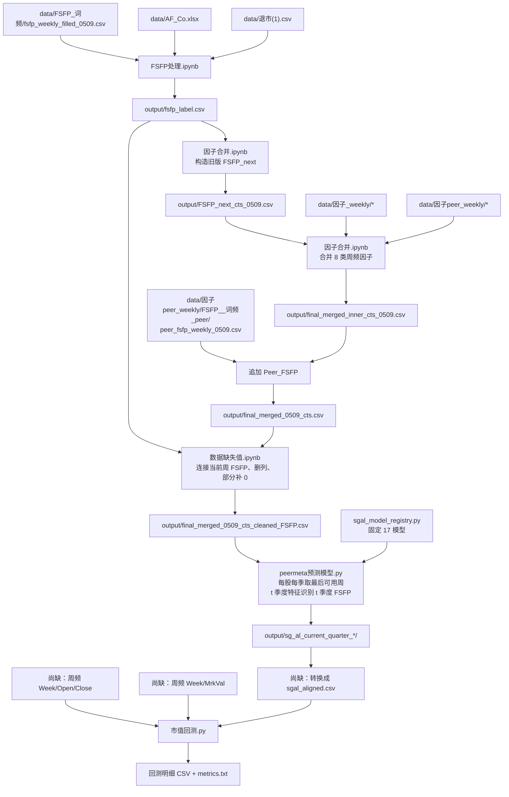

# 财务造假识别项目 workflow

> 更新时间：2026-07-24  
> 本文档以当前目录中的代码、数据文件、notebook 已保存输出和磁盘上的实际产物为准。  
> 当前项目没有统一调度入口；主流程由 3 个 notebook、4 个顶层 Python 脚本和若干已生成的周频数据目录串联。

## 1. 结论与当前状态

当前真正接入建模主链路的是“词频版 FSFP”，不是 LLM 版：

```text
词频版周频 FSFP
  -> 补齐上市/退市区间并生成 0/1/2 标签
  -> 构造历史 FSFP_next 中间表
  -> 与 8 类公司/同行周频因子做严格内连接
  -> 追加连续型 Peer_FSFP
  -> 连接当前周 FSFP、删列、部分补 0
  -> 每只股票、每季度取最后一个可用周的整行
  -> 143 个季度特征的当期 SG-AL 识别
  -> 信号格式转换
  -> 周度市值加权回测
```

截至当前目录状态：

- 上游标签、因子合并和建模清洗表已经存在于 `output/`。
- 最终清洗表为 **1,743,672 行 × 149 列**，覆盖 **4,643 只股票、522 个周**；`(code, week)` 无重复。
- 149 列包括：143 个模型特征、`code`、`week`、当前周 `FSFP`、旧字段 `FSFP_next`、`Year`、`week_num`。
- 模型先把周频表压缩为 **140,275 条股票—季度记录**，覆盖 **4,643 只股票、41 个季度（2015Q1—2025Q1）**；每条季度记录是该股票当季最后一个可用周的完整原始行。
- 当前 `peermeta预测模型.py` 默认运行全部季度窗口，并强制使用当前固定的 17 个模型。第一层使用 5 折 OOF，第二层只在完整第一层 OOF 特征上拟合一次。
- 当前磁盘上**没有**新版脚本应生成的 `output/sg_al_current_quarter_*` 结果目录。`output/peermeta_run*.log` 是旧版代码运行记录，不能当作当前季度模型结果。
- 回测脚本要求的周频价格目录、周频市值目录和 `sgal_aligned.csv` 当前都不存在，因此回测不能直接运行。

## 2. 主流程总图



## 3. 核心数据约定

### 3.1 主键

输入表的一行表示一只股票在一个周频时点的记录：

```text
主键 = (code, week)
```

- `code`：股票代码。上游 notebook 会提取第一段数字并补齐为 6 位字符串。
- `week`：`YYYYWW`，例如 `201501`。
- 最终清洗表的 `(code, week)` 唯一，无重复键。

模型读取后先按股票和季度抽样，季度建模面板的主键为：

```text
主键 = (code, quarter)
```

每个键只保留该股票当季 `week_order` 最大的整行；不同股票因数据覆盖不同，所选“最后一个可用周”可能不完全相同。

### 3.2 周编码

主链路的 FSFP 面板和模型使用 ISO 周：

- `FSFP处理.ipynb` 用 `datetime.isocalendar()` 把日期转成 `YYYYWW`。
- `peermeta预测模型.py` 用 `date.fromisocalendar(year, week, 1)` 还原该 ISO 周的周一；非法周会直接报错。

LLM 备选分支的同行脚本不同：当输入只有 `week_end` 时，它使用 `strftime("%Y%W")`。这是“日历年 + 周一制周号”，与 ISO 周不完全等价，不能未经核对直接接入主链路。

### 3.3 标签口径

当前模型是**季度当期识别**：

```text
第 t 季度最后一个可用周的 143 个特征
  -> 同一行、第 t 季度最后一个可用周的 FSFP
```

- 监督标签：季度抽样后保留行中的当前 `FSFP`。
- 模型内部名称：`FSFP_current`。
- `FSFP_next` 是历史“预测下一周”设计留下的中间字段；当前模型明确排除它。
- `FSFP` 和 `FSFP_next` 都不进入特征。

### 3.4 缺失值处理边界

缺失处理分两层完成：

1. `数据缺失值.ipynb` 只对“数值型且所有非空值都近似整数”的列补 0。
2. 其他连续变量缺失值保留到建模阶段，由每个滚动窗口、每个 OOF 折仅使用该折训练数据填补。

当前清洗表仍有 **59/149 列**含缺失值，主要包括：

| 列 | 缺失数 | 缺失率 |
|---|---:|---:|
| `gov__IHR` | 1,591,998 | 91.30% |
| `mkt__Vol` | 1,427,076 | 81.84% |
| `mkt__Turnover` | 1,422,779 | 81.60% |
| `peer_gov__NSAO-NSAO_均值` | 1,238,082 | 71.00% |
| `peer_gov__NSAO_均值` | 1,238,082 | 71.00% |
| `peer_fin__FSR`、`peer_fin__FSR_均值` | 各 617,405 | 35.41% |

因此，“cleaned”不表示所有特征都已全局补齐；最终补值在模型窗口内完成，以避免直接使用未来时期的统计量。

## 4. 目录与脚本角色

| 文件或目录 | 角色 | 是否进入当前主链路 |
|---|---|---|
| `data/FSFP_词频/` | 词频版连续 FSFP 及计算脚本 | 是 |
| `data/FSFP_llm/` | LLM 风险分修正版 FSFP | 否，备选分支 |
| `data/因子_weekly/` | 公司财务、治理、市场、情感周频因子 | 是，已生成数据 |
| `data/因子peer_weekly/` | 同行因子和 Peer FSFP | 是；主链路使用词频版 Peer FSFP |
| `FSFP处理.ipynb` | 完整股票—周面板和离散标签 | 是 |
| `因子合并.ipynb` | 质量检查、历史标签、8 类因子合并、Peer FSFP 追加 | 是 |
| `数据缺失值.ipynb` | 当前标签连接、删列、部分缺失补 0 | 是 |
| `peermeta预测模型.py` | 周频输入季度化、20 季度滚动 SG-AL 当期识别 | 是，当前新版尚无磁盘结果 |
| `peermeta预测模型_首窗口计时.py` | 首个12季度训练/单季度测试的全样本安全并行计时入口 | 可选性能测试 |
| `sgal_model_registry.py` | 固定 17 个基础学习器的唯一注册表；LMNN 和 RCA 已删除 | 是 |
| `市值回测.py` | 周度市值加权回测 | 计划使用；输入尚缺 |
| `单个公司股票原始数据/` | 5,187 个日频个股开收盘 CSV | 当前未被代码消费 |
| `mnsc.2023.03604/` | 论文官方年度代码和方法参考 | 参考，不是当前周频主链路 |

## 5. 上游 FSFP 数据

### 5.1 词频版 FSFP 计算脚本

脚本：`data/FSFP_词频/fsfp_log.py`

代码声明的输入：

| 输入 | 粒度和必要字段 | 处理用途 |
|---|---|---|
| `all_news_dir/*.csv` | 每公司一个文件；需要可识别的日期列 | 统计滚动窗口内公司全部新闻数 `N_it` |
| `fraud_news_dir/*.csv` | 每公司一个文件；`publish_time`, `article_content` | 计算欺诈词频和文章权重 |
| `AF_Co.xlsx`（可选） | 股票简称、公司全称 | 统计文章提及公司数 |

实际计算逻辑：

1. 文件名去前导零后，对齐全量新闻与欺诈新闻。
2. 欺诈词表固定为脚本内 30 个词。
3. 每篇欺诈新闻：
   - `ATF`：所有欺诈词在正文中的出现次数之和。
   - `NewsFirmCount`：正文命中的已知股票简称/公司全称数量，最少为 1。
4. 每个周一生成一个 365 天回看窗口，窗口为 `(week_end - 365天, week_end]`。
5. 代码实际使用：

   ```text
   IIF_j = log(TotalFirmCount_year / NewsFirmCount_j)
   FSFP_it = sum(ATF_j * IIF_j) / N_it
   ```

6. 若该窗口 `N_it=0` 或没有欺诈新闻，则 `FSFP=0`。

脚本输出字段为：

```text
stock_code, week_end, fsfp, n_total_news, n_fraud_news
```

当前限制：

- `__main__` 中的 `all_news_dir`、`fraud_news_dir`、`AF_Co.xlsx` 是占位路径，不能直接运行。
- 当前主链路输入 `fsfp_weekly_filled_0509.csv` 的字段是 `code, week, fsfp_original, FSFP`。
- 目录中没有把脚本原始输出进一步拼批、转换 ISO 周、补齐公司周并改成上述字段的完整代码。因此该文件应视为已准备好的外部/中间输入。
- 脚本顶部说明文字把 IIF 写成比值，但计算代码实际使用自然对数；本文按代码行为记录。

### 5.2 当前主链路的词频 FSFP 输入

文件：`data/FSFP_词频/fsfp_weekly_filled_0509.csv`

字段：

| 字段 | 含义 |
|---|---|
| `code` | 6 位股票代码 |
| `week` | ISO `YYYYWW` |
| `fsfp_original` | 连续型词频 FSFP |
| `FSFP` | 已存在的 0/1/2 标签 |

当前文件为 2,203,058 行、5,312 只股票。它与 `data/因子peer_weekly/FSFP__词频_peer/fsfp_weekly_filled_0509.csv` 的 SHA-256 相同，是同一份数据副本。

`FSFP处理.ipynb` 不信任输入中的 `FSFP` 列，而是仅读取前三列并重新生成标签。当前重算结果与输入标签逐行一致。

### 5.3 LLM 修正版 FSFP：备选分支

脚本：`data/FSFP_llm/fsfp_llm_ex.py`

它在词频版文章权重上再乘：

```text
llm_factor = log(1 + exp(risk_score))
```

实际分子为：

```text
sum(ATF * log(TotalFirmCount / NewsFirmCount) * llm_factor)
```

输入欺诈新闻需要：

- 日期：`pub_date` 或 `publish_time`
- 正文：`article` 或 `article_content`
- `risk_score`；不存在时补 0

输出：

```text
stock_code, week_end, fsfp, n_total_news, n_fraud_news
```

当前已有 `data/FSFP_llm/fsfp_weekly_corrected.csv`，但它没有被 `FSFP处理.ipynb` 或因子合并主链路读取。

注意：`data/LLM的打分方式.md` 描述的是“52 周内 risk_score 算术平均后再离散”的另一套算法；`fsfp_llm_ex.py` 实际实现的是对每篇文章的 `ATF × IIF` 乘 softplus 风险系数。两者不是同一公式。

## 6. Peer FSFP 的生成

主链路使用：

```text
data/因子peer_weekly/FSFP__词频_peer/
```

### 6.1 年度同行社区分组

脚本：`分组.py`

输入：

- `similarity_matrices/similarity_matrix_YYYY.pkl`
- 每个 pkl 应含：
  - `matrix`
  - `companies`
  - 可选但当前文件已有的 `company_to_idx`

处理：

1. 当前共有 24 个年度相似度矩阵，覆盖 2001—2024。
2. 只检查矩阵非对角上三角。
3. 当相似度严格大于 `0.5` 时连无向边。
4. 用 `networkx.greedy_modularity_communities` 划分社区。
5. 无边年份直接跳过。

输出：

```text
data/business_communities_all_years.csv
```

字段：

```text
Year, Community_ID, Symbol, Community_Size
```

当前结果：

- 47,872 行
- 24 年
- 11,916 个“年份—社区”
- 5,520 个不同公司代码

### 6.2 周频加权 Peer FSFP

脚本：`peer_fsfp_weekly.py`

输入：

| 输入 | 关键字段 |
|---|---|
| `fsfp_weekly_filled_0509.csv` | `code/week/fsfp_original` |
| `data/business_communities_all_years.csv` | `Year/Community_ID/Symbol` |
| `similarity_matrices/*.pkl` | 年度相似度矩阵 |

处理：

1. 把 `code -> Stkcd`、`week -> Week`。
2. 明确使用连续型 `fsfp_original`，覆盖内部临时列 `FSFP`；不使用 0/1/2 标签。
3. 建立 `(year, week_num, Stkcd) -> FSFP` 查找表。
4. 对每年、每周、每个社区计算：

   ```text
   Peer_FSFP_i =
       sum_j(similarity_ij * FSFP_j)
       / sum_j(similarity_ij)
   ```

5. 社区成员在该周没有 FSFP 时按 0 进入向量。
6. 权重使用社区内部完整相似度子矩阵，不只保留大于 0.5 的边；对角线也保留，因此计算包含公司自身。
7. 权重和为 0 时把分母改成 1。
8. 单成员社区、没有年度相似度矩阵、没有被社区覆盖的记录，均回退为自身 `fsfp_original`。
9. 2025 年无相似度矩阵，因此回退为自身值。

输出：

```text
peer_fsfp_weekly_0509.csv
```

字段：

```text
Stkcd, Week, Peer_FSFP
```

当前输出与输入同为 2,203,058 行，随后在因子合并阶段对代码补齐 6 位。

LLM 目录下存在同构的 `peer_fsfp_llm_weekly.py` 和输出，但当前主链路没有读取它。

## 7. FSFP 标签面板

入口：`FSFP处理.ipynb`

### 7.1 输入

| 文件 | 必要字段 | 当前作用 |
|---|---|---|
| `data/FSFP_词频/fsfp_weekly_filled_0509.csv` | `code`, `week`, `fsfp_original` | 连续 FSFP |
| `data/AF_Co.xlsx` | `证券代码`/`Stkcd`，`首次上市日期`/`Listdt` | 选股和上市起点 |
| `data/退市(1).csv` | 股票代码、退市日期 | 退市截断 |

代码会优先检查 `data/退市.csv`，不存在时使用当前存在的 `data/退市(1).csv`。

### 7.2 数据处理

1. 股票代码提取数字并补成 6 位。
2. `week`、`fsfp_original` 强制转数值；无效值变 NaN。
3. 上市和退市日期兼容普通日期及 Excel 序列日期。
4. 取 `AF_Co.xlsx` 清洗后前 5,400 行，再按股票代码保留第一次出现。
5. 上市周早于 `201501` 的统一截断到 `201501`。
6. 同一股票多条退市记录取最早退市周。
7. 无退市记录的结束周为固定的 `202529`；更晚退市也截断到 `202529`。
8. 原始 FSFP 若同一 `(code, week)` 重复，排序后保留最后一条。
9. 生成 `201501—202529` 的 ISO 周序列；每家公司只保留上市周至退市/全局截止周。
10. 左连接原始 FSFP；没有新闻值或无法转数值的 `fsfp_original` 补 0。
11. 在完整面板中计算 `fsfp_original != 0` 的全市场中位数。
12. 离散标签：

   ```text
   FSFP = 0: fsfp_original <= 0 或等于 0 时保留默认值
   FSFP = 1: 0 < fsfp_original <= 非零中位数
   FSFP = 2: fsfp_original > 非零中位数
   ```

   当前数据非零中位数为 `1.647364845126133`。

### 7.3 输出

文件：`output/fsfp_label.csv`

```text
code, week, fsfp_original, FSFP
```

当前结果：

| 指标 | 数值 |
|---|---:|
| 行数 | 2,203,058 |
| 股票数 | 5,312 |
| `FSFP=0` | 1,044,440 |
| `FSFP=1` | 579,310 |
| `FSFP=2` | 579,308 |
| 非 0 标签比例 | 52.5914% |

## 8. 因子数据与合并

入口：`因子合并.ipynb`

### 8.1 当前因子目录盘点

| 组 | 目录 | CSV 数 | 文件名股票数 | 合并前原始因子列 |
|---|---|---:|---:|---:|
| 公司财务 | `data/因子_weekly/财务因子_周频` | 5,636 | 5,636 | 15 |
| 公司治理 | `data/因子_weekly/治理因子_周频` | 21,957 | 6,780 | 5 |
| 公司市场 | `data/因子_weekly/市场因子_周频` | 5,702 | 5,702 | 8 |
| 公司情感 | `data/因子_weekly/情感因子_周频` | 5,752 | 5,752 | 3 |
| 同行财务 | `data/因子peer_weekly/财务因子peer_weekly` | 5,636 | 5,636 | 45 |
| 同行治理 | `data/因子peer_weekly/治理因子peer_weekly` | 7,166 | 7,166 | 36 |
| 同行市场 | `data/因子peer_weekly/市场因子peer_weekly` | 5,605 | 5,605 | 27 |
| 同行情感 | `data/因子peer_weekly/情感因子peer_weekly` | 5,752 | 5,752 | 9 |

公司治理因子按因子拆成 5 个子目录：

```text
3yMC_weekly, Board_weekly, IHR_weekly, IndDre_weekly, NSAO_weekly
```

合并代码递归读取它们，再按 `(code, week)` 的 `groupby().first()` 把不同子目录中的非空列拼到同一行。

当前目录没有生成上述 8 类周频因子的完整脚本。这些 CSV 是已准备好的输入；`mnsc.2023.03604/factors_gen.py` 是论文年度版参考实现，不直接生成当前周频目录。

### 8.2 两个可选清理 cell

notebook 前两个 cell 会生成：

```text
output/治理因子peer_weekly_filtered/
output/市场因子peer_weekly_filtered/
```

治理清理：

- 若不存在 `NSAO-NSAO_均值`，新增并全填 0。
- 若存在，只把该列缺失填 0。

市场清理：

- 保留 `Week`。
- 只保留匹配 `^.+-.+_均值$` 的差值列。

重要：后面的正式合并 cell 仍读取 `data/因子peer_weekly/...` 原始目录，**不读取这两个 filtered 输出**。因此单独运行清理 cell 不会改变最终建模表，除非同步修改 `FACTOR_FOLDERS`。当前磁盘也没有这两个 filtered 目录。

### 8.3 覆盖审计

notebook 会把 `AF_Co.xlsx` 与四个公司因子目录的文件名股票代码比较，预期输出：

```text
output/股票覆盖对比结果.csv
output/股票覆盖对比明细/*.csv
output/股票代码按行对齐表.csv
```

这些是质量审计，不进入合并。当前磁盘没有这些文件；notebook 中保存的旧输出文本也不完全等于当前目录文件数，重跑时应刷新。

### 8.4 周连续性检查

对 `output/fsfp_label.csv`：

1. `week` 转整数。
2. 拆出年份和周号。
3. 检查周号是否在 1—53。
4. 对同一股票、同一年去重排序。
5. 检查相邻周号差是否为 1。

该检查只检查年内连续性，不检查跨年衔接；只打印结果，不写出文件，也不修改数据。

### 8.5 构造历史字段 `FSFP_next`

当前 notebook 仍执行：

```python
df["FSFP_next"] = df.groupby("code")["FSFP"].shift(-1)
```

随后删除每只股票最后一行并保存：

```text
output/FSFP_next_cts_0509.csv
```

字段：

```text
code, week, fsfp_original, FSFP, FSFP_next
```

当前结果：

| 指标 | 数值 |
|---|---:|
| 输入行数 | 2,203,058 |
| 删除每只股票末周后 | 2,197,746 |
| 股票数 | 5,312 |

该步骤属于旧版下一周预测口径。后续 8 因子合并只保留 `code, week, FSFP_next`；当前周 `FSFP` 会在缺失处理 notebook 中重新连接。当前模型不使用 `FSFP_next`。

### 8.6 合并 8 类因子

输入：

```text
output/FSFP_next_cts_0509.csv
8 个公司/同行因子目录
```

字段标准化：

- 股票代码优先读取文件内 `code` / `Stkcd` / `stock_code`，否则使用文件名。
- 代码提取第一段数字并补 6 位。
- 周字段识别 `week` / `Week` / `trdweek`，去掉 `.0` 后转整数。
- 文件按 `utf-8-sig`、`utf-8`、`gbk`、`gb18030` 顺序尝试读取。

因子处理：

1. 先扫描 FSFP 和 8 个目录都具有文件的共同股票，当前执行得到 4,644 只。
2. 仅加载这些股票对应的文件。
3. 删除原始代码列、周列、`fsfp_original` 和 `FSFP`。
4. 按来源加前缀：

   ```text
   fin__, gov__, mkt__, sent__,
   peer_fin__, peer_gov__, peer_mkt__, peer_sent__
   ```

5. 单文件内同键重复保留 first。
6. 同一目录拼接后，再按 `(code, week)` 执行 `groupby().first()`。
7. 以旧版 FSFP 表为起点，依次与 8 张因子表做 `inner merge`。

`inner merge` 只要求该表存在相同的 `(code, week)` 键，不要求该行所有因子非空。各步行数变化：

| 合并阶段 | 合并后行数 |
|---|---:|
| FSFP 裁剪到 4,644 个共同股票 | 2,019,638 |
| 公司财务 | 1,949,858 |
| 公司治理 | 1,943,410 |
| 公司市场 | 1,943,162 |
| 公司情感 | 1,943,162 |
| 同行财务 | 1,943,162 |
| 同行市场 | 1,743,672 |
| 同行治理 | 1,743,672 |
| 同行情感 | 1,743,672 |

输出：

```text
output/final_merged_inner_cts_0509.csv
```

当前为：

- 1,743,672 行
- 151 列
- 4,643 只股票
- 522 个周
- 列构成：`code`, `week`, `FSFP_next` + 148 个因子

同行市场因子 27 列中包含：

```text
peer_mkt__WeekID
peer_mkt__WeekID_均值
peer_mkt__WeekID-WeekID_均值
```

当前模型按 `peer_mkt__*` 规则把这三个时间标识衍生列也作为特征。

### 8.7 追加连续型 `Peer_FSFP`

输入：

| 文件 | 作用 |
|---|---|
| `output/final_merged_inner_cts_0509.csv` | 8 类因子表 |
| `data/因子peer_weekly/FSFP__词频_peer/peer_fsfp_weekly_0509.csv` | 连续型同行 FSFP |

处理：

1. 统一 `code/week`。
2. 因子列在 `Peer_FSFP`、`peer_fsfp`、`FSFP` 中自动识别，并统一命名为 `Peer_FSFP`。
3. 同一 `(code, week)` 保留 first。
4. 先裁剪共同股票，再按 `(code, week)` 做内连接。

输出：

```text
output/final_merged_0509_cts.csv
```

当前为 1,743,672 行 × 152 列；追加过程没有减少行数。

## 9. 缺失处理与最终建模表

入口：`数据缺失值.ipynb`

### 9.1 输入

| 文件 | 读取内容 |
|---|---|
| `output/final_merged_0509_cts.csv` | 旧标签和全部候选因子 |
| `output/fsfp_label.csv` | 只读 `code`, `week`, `FSFP` |

### 9.2 数据处理

1. 两个文件的 `code` 都提取数字并补 6 位。
2. `week` 去掉 `.0`、去空格并补成 6 位字符串。
3. 按 `(code, week)` 左连接当前周 `FSFP`。
4. notebook 的审计变量 `fsfp_col` 仍设置为 `FSFP_next`，所以屏幕上首先展示的是旧字段分布；这只影响审计显示和必需列检查，不会改变随后连接的当前周 `FSFP`。
5. 构造：

   ```text
   Year = week 前 4 位
   week_num = week 后 2 位
   ```

6. 删除以下 6 列：

   ```text
   fin__FSR
   peer_fin__FSR-FSR_均值
   gov__3yMC
   peer_gov__3yMC-3yMC_均值
   peer_fin__EIR-EIR_均值
   fin__EIR
   ```

   这是部分删除：例如 `peer_fin__FSR`、`peer_fin__FSR_均值`、`peer_fin__EIR`、`peer_fin__EIR_均值`、`peer_gov__3yMC`、`peer_gov__3yMC_均值` 仍保留。

7. 对每列判断：
   - 必须是 pandas 数值类型；
   - 所有非空值都满足“接近整数”。
8. 这些整数值列的 NaN 统一填 0。该规则不仅作用于哑变量，也会作用于当前数据中被判定为整数值的 `mkt__MrkVal`、`peer_mkt__MrkVal*`、`WeekID*` 等列。
9. 连续值列的缺失不在此处填补。
10. 不做缩尾、不做异常值裁剪、不做标准化、不删除缺失行。

### 9.3 输出

```text
output/final_merged_0509_cts_cleaned_FSFP.csv
```

当前数据契约：

| 项目 | 数值 |
|---|---:|
| 行数 | 1,743,672 |
| 列数 | 149 |
| 股票数 | 4,643 |
| 周数 | 522 |
| 周范围 | `201501—202513` |
| 重复 `(code, week)` | 0 |
| 当前 `FSFP` 缺失 | 0 |
| `FSFP_next` 缺失 | 0 |

标签分布：

| 标签 | 当前周 `FSFP` | 旧字段 `FSFP_next` |
|---:|---:|---:|
| 0 | 784,417 | 784,764 |
| 1 | 489,524 | 488,692 |
| 2 | 469,731 | 470,216 |

## 10. 最终 143 个模型特征

`peermeta预测模型.py` 对特征分组和数量做硬校验；不符合即停止。

| 特征组 | 前缀/列 | 数量 |
|---|---|---:|
| 公司财务 | `fin__*` | 13 |
| 公司治理 | `gov__*` | 4 |
| 公司市场 | `mkt__*` | 8 |
| 公司情感 | `sent__*` | 3 |
| 同行财务 | `peer_fin__*` | 43 |
| 同行市场 | `peer_mkt__*` | 27 |
| 同行治理 | `peer_gov__*` | 35 |
| 同行情感 | `peer_sent__*` | 9 |
| 同行 FSFP | `Peer_FSFP` | 1 |
| **合计** |  | **143** |

明确排除：

```text
code, week, FSFP, FSFP_current, FSFP_next,
Year, year, week_num, week_order, week_start,
quarter_num, quarter, quarter_period,
target_week, target_quarter, target_quarter_period, oof_fold
```

任何既不属于上述 9 组、也不在排除名单中的列都会触发错误，防止未知字段静默进入模型。

## 11. PeerMeta / SG-AL 当期识别

入口：`peermeta预测模型.py`  
模型注册：`sgal_model_registry.py`

### 11.1 运行参数

| 参数 | 默认值 | 含义 |
|---|---|---|
| 输入 | `output/final_merged_0509_cts_cleaned_FSFP.csv` | 周频最终建模表 |
| `TRAIN_WINDOW_QUARTERS` | 20 | 每个训练窗口固定 5 年、20 个连续季度 |
| 测试窗口 | 1 个季度 | 每次识别紧接训练窗口的一个季度 |
| 滚动步长 | 1 个季度 | 完成一个测试季度后，整个窗口后移一季度 |
| `oof_folds` | 5 | 连续时间 OOF 折 |
| 每个 OOF 折 | 4 个连续季度 | 20 个季度按时间顺序等分 |
| `SG_AL_RUN_MODE` | `full` | 默认运行全部可用季度窗口 |
| `SG_AL_SINGLE_TEST_QUARTER` | 空 | 单季度模式下，空值表示第一个可用测试季度 |
| `SG_AL_SINGLE_QUARTER_TRAIN_MAX_ROWS` | 5000 | 单季度冒烟测试的训练样本上限 |
| `MODEL_PARALLEL_JOBS` | 1 | 正式入口默认逐个模型串行；首窗口计时入口单独覆盖为最多 6 |
| 模型内部线程上限 | 1 | 避免单个模型额外占用过多线程 |
| `consensus_fraction` | 0.1 | 每轮选初始测试池约 10% |

默认正式运行：

```powershell
python .\peermeta预测模型.py
```

正式入口把 `MODEL_PARALLEL_JOBS` 固定为 1，不读取终端中同名的旧环境
变量。首窗口计时入口在导入正式模块后只对当前进程覆盖为最多 6，因此
不会改变单独运行 `peermeta预测模型.py` 时的默认串行行为。

需要先做单季度冒烟测试时：

```powershell
$env:SG_AL_RUN_MODE = "single_quarter_test"
$env:SG_AL_SINGLE_TEST_QUARTER = "2020Q1"  # 可省略
python .\peermeta预测模型.py
```

脚本读取 `code` 和 `week` 时显式指定字符串类型；`code` 会提取数字并补齐为 6 位。

### 11.2 周频输入如何转成季度值

季度化不是均值、求和或季度末固定周连接，而是“每只股票、每季度取最后一个可用周的整行”：

1. 检查必要字段 `code`、`week`、`FSFP`。
2. 把 `week` 清洗为 6 位 `YYYYWW`，并验证 `(code, week)` 唯一。
3. 生成 `year`、`week_num`、`week_order` 和 ISO 周一 `week_start`；非法 ISO 周会报错。
4. 按固定周号划分季度：

   ```text
   Q1 = W01-W13
   Q2 = W14-W26
   Q3 = W27-W39
   Q4 = W40-W53
   ```

5. 按 `(code, quarter_period)` 分组，用 `week_order.idxmax()` 定位最后一周的原始整行；只对抽取后的季度面板排序，不再排序 174 万行 × 149 列的完整宽表。
6. 再用分组最大周号核验所选记录确实是该股票当季最后一个可用周。
7. 该整行的 143 个特征作为季度特征，同一行的 `FSFP` 作为季度标签 `FSFP_current`。因此特征和标签同源、同周、同季度，没有分别聚合。
8. 标签必须是整数 0/1/2；其他值报错，缺失标签在构造建模面板时删除。

需要注意：

- “最后一个可用周”不等于强制取 W13/W26/W39/W53；若某股票季末周缺失，会取其当季更早的最后一条记录。
- 不同股票在同一季度可能来自不同周。
- `FSFP_next` 不参与标签或特征；`Peer_FSFP` 仍是 143 个特征之一。

当前输入的实际转换结果：

| 项目 | 数值 |
|---|---:|
| 周频输入 | 1,743,672 行 |
| 季度记录 | 140,275 行 |
| 股票数 | 4,643 |
| 季度数 | 41 |
| 季度范围 | `2015Q1—2025Q1` |

### 11.3 滚动窗口和五折划分

对测试季度 `t`：

```text
训练季度：[t-20, t-1]，共 20 个连续季度
测试季度：t
下一窗口：训练起点、终点和测试季度均后移 1 个季度
```

- 规则示例：`2011Q1—2015Q4 -> 2016Q1`，下一窗口为 `2011Q2—2016Q1 -> 2016Q2`。
- 当前数据实际产生 21 个窗口：首个为 `2015Q1—2019Q4 -> 2020Q1`，最后一个为 `2020Q1—2024Q4 -> 2025Q1`。
- 同一季度的全部公司属于同一个 OOF 折。
- 20 个训练季度按时间排序后切成 5 个连续验证块，每折 4 个季度；不是随机 K 折。
- 每个 OOF 模型用其余 16 个季度训练、当前 4 个季度验证。这是连续时间块 OOF，不是只用过去预测未来的 expanding-window 验证。
- 单季度测试模式按 `oof_fold × 标签` 分层抽样，最多保留默认 5,000 条训练记录；测试季度不抽样。
- 全量模式不压缩训练集。
- 窗口逐个构造、执行、落盘和释放，不同时缓存所有五年矩阵。

### 11.4 折内缺失填补和标准化

季度面板确定后，143 个特征先统一执行一次 `pd.to_numeric(errors="coerce")`。该步骤只改变存储类型：无法解析的值变 NaN，但不在全局填补。这样同一条历史记录不会在重叠窗口和每个 OOF 折中反复解析。逐列的转换前后非空数及新增 NaN 数会写入 `sg_al_feature_numeric_coercion_audit.csv`；当前真实输入验证中新增 NaN 总数为 0。

第一层的每个 OOF 拟合以及完整训练集拟合都独立建立预处理器：

1. 所有特征强制转数值，失败值变 NaN。
2. 只用本次拟合的训练部分计算每只股票的特征中位数。
3. 再计算本次训练部分的全局特征中位数；全列仍缺失时补 0。
4. 训练和对应验证/测试数据先用该股票在训练部分的中位数填补。
5. 仍缺失的用训练期全局中位数填补。
6. 只用本次训练部分计算均值和总体标准差 `ddof=0`。
7. 标准差为 0 或 NaN 时改为 1。
8. 第二层输入是第一层的 17 列硬标签，不再执行原始特征填补和标准化。

这种处理避免用测试季度或当前 OOF 验证折的统计量填补和标准化。

### 11.5 固定 17 个基础学习器

两层都必须按固定顺序使用：

```text
LDA, QDA, Logit, Probit, NaiveBayes,
Tree-ID3, Tree-C4.5, Tree-CART,
FNN1, FNN2, FNN3,
SVM-Lin, SVM-Poly, SVM-RBF,
KNN, NCA, ITML
```

关键实现事实：

- `Probit` 实际复现为 `LogisticRegression(solver="sag")`，不是严格 Probit。
- `Tree-ID3` 和 `Tree-C4.5` 都是 sklearn 的 entropy 决策树；没有实现 C4.5 的增益率。
- NCA、ITML 是“度量学习器 + KNN” Pipeline。
- LMNN 因完整训练历史单次约 5 小时而删除。
- RCA 曾作为 LMNN 的替代模型，但默认 `n_chunks=100, chunk_size=2`
  无法支持 143 维输入，内部协方差秩不足并生成全 NaN 变换结果，因此也已删除。
- ITML 需要 `metric-learn`。
- 第一层任一模型在任一 OOF 折或完整训练拟合失败，当前窗口立即失败；第二层任一完整训练拟合失败也立即失败。
- 失败位置会追加写入 `sg_al_required_model_failure.csv`。
- 多个模型没有固定自身的 `random_state`，重复运行不保证完全一致。
- OOF 折、SG-AL 迭代和季度窗口保持串行，禁止与模型并行叠乘。
- 正式入口固定 `MODEL_PARALLEL_JOBS=1`；首窗口计时入口使用资源分组调度。
- 资源分组模式先让 NCA 在独立 `spawn` 子进程中独占运行；该进程完全退出
  后，其余 16 个模型才进入 `loky` 进程池。
- 普通模型请求并发为 6；批次开始时按可用物理内存自动降级：
  `>=16 GiB` 为 6、`12—16 GiB` 为 4、`8—12 GiB` 为 2、低于 8 GiB 为 1。
- 普通模型按预计耗时从长到短提交，使 SVM 优先启动；完成结果最终仍按
  固定注册表顺序重排，不改变 stacking 列含义。
- 每个模型实际开始和完成时打印墙钟时间、window、iteration、layer、
  OOF 折、模型序号、阶段完成数、PID、样本数、单模型耗时和阶段累计耗时。
- 普通并行结果使用无序完成流，模型结束后立即打印，不等待整批完成。
- 串行模式任一模型失败后立即返回并终止当前折；资源分组模式下 NCA
  失败时不会启动后续普通模型。

### 11.6 两层 stacking 与伪标签反馈

每轮处理：

1. 第一层：
   - 每个模型生成训练集 5 折 OOF 硬标签 `Z_train`。
   - 同一模型在完整当前训练集上拟合并预测剩余测试池，得到 `Z_test`。
2. 第二层：
   - 17 个模型分别以完整 `Z_train` 和当前训练标签拟合一次。
   - 直接预测 `Z_test`，得到固定顺序的 17 列硬标签 `P_test`。
   - 不再生成第二层 OOF `P_train`，因为当前结构没有第三层模型，也没有任何步骤消费 `P_train`。
3. 对每条测试样本：

   ```text
   p_mean = 17 个第二层硬标签的均值
   p_std  = 17 个硬标签的总体标准差
   pred_label = p_mean 距离最近的 0/1/2
   agreement_rate = 众数标签占比
   s_tilde = p_std
   ```

4. 按 `p_std` 从小到大选择本轮最一致的样本；`agreement_rate` 只记录，不参与排序。
5. 把 `pred_label` 当作伪标签加入训练集，并把这些样本从测试池删除。
6. 反馈样本被分到最后一个 OOF 折。
7. 两层模型在下一轮重新训练。
8. 默认每轮选择 `ceil(初始测试样本数 × 0.1)`，直到测试池为空，通常约 10 轮。

这是用模型共识生成伪标签的自训练流程，不是人工返回真实标签的查询式主动学习。

在每个 SG-AL 迭代中：

```text
第一层：17 × (5 个 OOF 拟合 + 1 个完整拟合) = 102 次
第二层：17 × 1 个完整拟合                    = 17 次
合计                                        = 119 次
```

相较两层都做 5 折 OOF 的 204 次拟合，当前结构每轮减少 85 次，即约 41.7%。只有增加第三层、需要第二层无泄漏训练预测或做独立校准时，才需要恢复第二层 OOF。

### 11.7 评价指标

用测试季度所选末周记录中的真实 `FSFP` 离线评价：

- 每类 `precision / recall / f1 / support`
- 每类 one-vs-rest `acc_0 / acc_1 / acc_2`
- 总体 `accuracy`
- `macro_f1`
- `weighted_f1`
- 混淆矩阵

### 11.8 输出

单季度测试目录：

```text
output/sg_al_current_quarter_single_quarter_model17_nca_full/
```

全季度目录：

```text
output/sg_al_current_quarter_quarterly_full_model17_nca_full/
```

训练开始前即写出的审计文件：

```text
sg_al_target_alignment_audit.csv
sg_al_target_alignment_by_quarter.csv
sg_al_quarter_sampling_audit.csv
sg_al_feature_availability_audit.csv
sg_al_feature_numeric_coercion_audit.csv
sg_al_feature_group_counts.csv
sg_al_window_definitions.csv
```

每个成功窗口写入：

```text
window_partitions/{YYYYQn}/
  predictions.csv
  iteration_log.csv
  model_log.csv
  metrics.csv
  window_manifest.json
```

顶层汇总：

```text
sg_al_predictions.csv
sg_al_window_metrics.csv
sg_al_pooled_metrics.csv
sg_al_iteration_logs.csv
sg_al_model_logs.csv
sg_al_window_mean_metrics.csv
sg_al_window_definitions.csv
sg_al_completed_window_definitions.csv
sg_al_model_status_summary.csv
sg_al_run_manifest.json
```

- `sg_al_predictions.csv`、迭代日志和模型日志按窗口增量追加，不需要把所有窗口结果同时保存在内存。
- `predictions.csv` 同时保留 `code`、所选源周 `week`、`quarter`、`pred_label` 和真实标签等字段。
- `sg_al_run_manifest.json` 明确记录季度取值规则、当期标签对齐、第一层 OOF 策略和第二层单次完整拟合策略。

### 11.9 当前可运行性

当前目录未发现上述新版输出目录。

已完成的代码级检查包括：语法编译、季度末周选择、20 季度滚动窗口、5 折季度分配、143 特征契约、17 个模型逐一小样本拟合，以及模型级安全并行调度测试。尚未执行 21 个窗口的完整全量训练。

固定 17 模型、约 10 轮伪标签反馈和大规模季度截面仍会带来较高时间与内存成本。LMNN 和 RCA 已删除，但 NCA 保持全样本算法不变；单季度 5,000 条训练样本模式只用于验证端到端流程，不等同于全量结果。

### 11.10 已实施优化与保留项

不改变季度口径、17 列 stacking 或预测结果定义的优化：

1. 季度抽样使用分组 `idxmax` 取得末周行，只把约 14 万条季度记录全局排序一次；重叠滚动窗口不再反复排序宽表。
2. 143 个特征在季度面板生成后只转数值一次；缺失填补仍严格留在每个第一层拟合内部。
3. 第二层取消无消费者的 5 折 OOF；当前 17 模型契约下，每轮拟合数由
   两层都做 OOF 时的 204 次降为 119 次。
4. 第二层均值、标准差和众数占比改用 NumPy 向量化计算。
5. 伪标签样本选择只排序 `p_std` 和原始顺序两个向量，不复制整张预测元数据表。
6. 不再在每个基础模型结束后调用 `gc.collect()`；改在折、SG-AL 迭代和窗口边界集中回收。
7. 首窗口入口使用“NCA 独占子进程 + 其余 16 模型最多 6 个 loky 进程”
   的资源分组调度；正式入口默认仍为逐模型串行。
8. 分窗口结果即时落盘，顶层预测和日志增量追加，避免所有窗口结果常驻内存。
9. 模型完成结果按无序流实时返回并打印，但在生成两层 stacking 特征前
   按固定模型注册表恢复列顺序。

仍可进一步优化、但当前没有自动启用：

- **CSV 分块季度化**：可继续降低读取 2.61 GB 输入时的峰值内存，但需要跨块严格检查重复键、统一类型并合并跨块季度末行，改动和验证成本较高。
- **窗口断点续跑**：可跳过已有且校验完整的季度分区，但必须同时设计配置指纹和产物完整性检查，避免误用旧参数结果。
- **正式全季度并行**：基础流水线已具备 NCA 独占和普通模型有界并行能力，
  但正式入口仍固定为 1；只有首窗口基准验证稳定后才应考虑提高正式入口并发。
- **NCA 内存**：NCA 没有抽样、降维或替换。独占调度只消除与其他模型
  同时驻留造成的额外风险，不能消除 NCA 自身的样本数平方内存；32 GB
  机器上的完整训练仍可能失败。

本次真实数据阶段验证只运行到季度化和特征契约：结果仍为 140,275 条季度记录、4,643 只股票、41 个季度和 143 个特征；没有启动 21 个窗口的完整训练。

### 11.11 首窗口全样本计时

入口：

```text
peermeta预测模型_首窗口计时.py
```

该脚本用于测量“完整识别一个季度”的实际时间。“小样本”仅表示只跑一个滚动窗口，不对窗口内部抽样：

```text
训练：数据集最早连续 12 个季度（3 年）
测试：紧接的第 13 个季度
OOF：3 折，每折为连续 4 个季度
当前实际窗口：2015Q1—2017Q4 -> 2018Q1
训练行上限：无
SG-AL：持续反馈直到该测试季度样本池为空
```

3 年、3 折配置只在计时脚本的当前进程中覆盖正式模块常量；
`peermeta预测模型.py` 单独运行时仍保持 5 年、5 折和
`MODEL_PARALLEL_JOBS=1`。计时脚本强制使用 `full` 数据路径，并在导入
正式模块后将普通模型请求并发覆盖为最多 6：

```text
NCA：独立 spawn 子进程独占运行，不抽样、不降维
其余 16 模型：最多 6 个 loky 进程，可按可用内存降为 4/2/1
所有模型内部线程：1
OOF 折：1
SG-AL 迭代：1
季度窗口：1
```

每个模型开始和完成时都会输出当前墙钟时间、窗口、迭代、层、折、模型
序号、阶段完成数、PID、拟合/预测行数、单模型耗时和阶段累计耗时。
NCA 启动前还会打印其核心矩阵粗略内存估算与当前可用物理内存；这只是
风险提示，不会改变 NCA 的输入或算法。

运行：

```powershell
python .\peermeta预测模型_首窗口计时.py
```

输出目录：

```text
output/sg_al_current_quarter_first_window_3year_benchmark_model17_nca_full/
```

主要文件：

```text
benchmark_summary.json   # 数据处理、模型识别、写盘和总耗时
window_definition.json   # 实际训练/测试季度和样本数
predictions.csv
iteration_log.csv
model_log.csv
metrics.csv
```

## 12. SG-AL 到回测信号的缺失适配步骤

`市值回测.py` 要求单文件：

```text
sgal_aligned.csv
```

必要字段：

```text
Stkcd, Week, FSFP
```

而模型预测字段主要是：

```text
code, week, quarter, pred_label
```

当前目录没有自动转换脚本。转换契约应为：

```text
code       -> Stkcd，补齐 6 位
pred_label -> FSFP，必须为 0/1/2
```

其中 `week` 是每只股票在被识别季度中实际选中的最后一个可用源周，不能不加判断地直接重命名为回测 `Week`：

- 同一季度不同股票的源周可能不同。
- 该季度预测使用了源周整行的信息，不能假定在该周开盘前已经可得。
- 若只把源 `week` 改名为 `Week`，信号会稀疏且可能产生同周前视偏差。

接入周频回测前必须先确定独立的“信号可交易周”规则。较保守的示例是：季度识别完成后，把信号映射到下一季度第一个可交易周；如果要在整个下一季度持有，还需明确向哪些周前向填充。该映射当前尚未实现。

全季度模式既可直接读取顶层增量汇总：

```text
output/sg_al_current_quarter_quarterly_full_model17_nca_full/
  sg_al_predictions.csv
```

也可递归核对：

```text
output/sg_al_current_quarter_quarterly_full_model17_nca_full/
  window_partitions/*/predictions.csv
```

完成交易周映射和字段重命名后，必须检查 `(Stkcd, Week)` 唯一，并核对每个季度信号只流向规定的未来交易周。

## 13. 市值加权回测

入口：`市值回测.py`

### 13.1 输入

当前硬编码配置：

| 参数 | 当前值 | 必要字段 | 当前是否存在 |
|---|---|---|---|
| `price_folder` | `4414公司单个公司周度开收盘数据` | 每股 CSV：`Week, Open, Close` | 否 |
| `mcap_folder` | `市值` | 每股 CSV：`Week, MrkVal` | 否 |
| `fsfp_file` | `sgal_aligned.csv` | `Stkcd, Week, FSFP` | 否 |
| `START_YEAR` | 2018 |  |  |
| `END_YEAR` | `None` |  |  |
| `INITIAL_CAPITAL` | 3000 |  |  |

三个目录/文件均按运行时工作目录的相对路径解析。

### 13.2 数据加载

股票代码：

- 文件名或 `Stkcd` 先尝试转数字，再补成 6 位。
- 转换失败时提取第一段数字。

周频价格：

1. 只扫描价格目录顶层 `*.csv`，不递归。
2. `Week` 读为字符串。
3. `Open`、`Close` 转数值。
4. 删除开盘或收盘缺失行。
5. 按 `Week` 设索引。
6. 单个文件读取失败时静默跳过。

周频市值：

1. 只扫描顶层 `*.csv`。
2. `MrkVal` 转数值。
3. 删除缺失和 `MrkVal <= 0` 的行。
4. 按 `Week` 设索引。

FSFP/预测信号：

1. `Stkcd -> Stock` 并补 6 位。
2. `FSFP` 转数值。
3. 已有行的 `FSFP` 缺失会填 0，因此会被当作可投资信号。
4. 构造 `(Stock, Week) -> FSFP` 字典；重复键后出现的值覆盖前值。

### 13.3 每周组合构造

周集合来自所有价格文件中的 `Week` 并集，再按起止年份筛选。

股票必须同时满足：

```text
本周有价格
本周有正市值
本周存在 FSFP 记录
FSFP == 0
Open > 0
Close 非空
```

对合格股票：

```text
weight_i = MrkVal_i / sum(MrkVal)
investment_i = current_capital * weight_i
shares_i = investment_i / Open_i
week_end_value_i = shares_i * Close_i
```

组合周末资金是所有股票周末价值之和；下一周重新全额再平衡。

没有合格股票时：

- 资金保持不变；
- 周收益为 0。

代码会无条件跳过价格周集合中的最后一周。

未考虑：

- 交易费用
- 印花税
- 滑点
- 涨跌停和停牌成交约束
- 最小交易单位
- 现金利息

### 13.4 指标

输出指标：

- 总收益率
- 年化收益率
- 年化波动率
- 最大回撤
- 夏普比率
- 回测周数
- 盈利/亏损/持平周
- 各数据源覆盖和平均实际投资股票数

配置中的 `RISK_FREE_RATE = 0` 没有传入 `calculate_metrics()`；实际夏普比率仍使用函数默认年化无风险利率 `0.025`。

### 13.5 输出

当前默认文件名：

```text
marketcap_weighted_backtest_2018_to_end_cap3000fsfp_sg_al_aligned_pred.csv
marketcap_weighted_backtest_2018_to_end_cap3000fsfp_sg_al_aligned_pred_metrics.txt
```

CSV 每周字段：

```text
Week
Total_Stocks_Price
Stocks_With_Mcap
Stocks_With_FSFP
FSFP_NonZero
FSFP_Zero_Total
Eligible_Stocks
Total_Market_Cap
Start_Capital
End_Capital
Weekly_Return
Cumulative_Return
```

控制台最后打印的指标文件名多拼了一段 `metricsfsfp_sg_al_aligned_pred.txt`，与真正写出的 `*_metrics.txt` 不一致。

### 13.6 时间可得性

当前 SG-AL 使用 t 季度内每只股票最后一个可用周的特征识别 t 季度 FSFP。若将该预测用于同一个源周的开盘交易，会使用尚未完整形成的当周信息，存在前视偏差。

严谨回测至少应：

- 等 t 季度识别所需数据全部可得后，再把信号用于之后的交易周，最简单是下一季度首个可交易周；或
- 按每个源数据的真实发布时间构建 point-in-time 可得时间，再确定逐股信号生效周。

## 14. 当前日频股价数据

目录：

```text
单个公司股票原始数据/单个公司原始数据/
```

| 子目录 | CSV 数 |
|---|---:|
| `2447个单个公司原始数据` | 2,082 |
| `中证500单个公司的原始数据` | 447 |
| `后3000单个公司原始数据1` | 2,375 |
| `沪深300单个公司原始数据` | 283 |
| **合计** | **5,187** |

字段统一为：

```text
日期_Date, 开盘价(元)_Oppr, 收盘价(元)_Clpr
```

这些是日频中文字段，且不同子目录之间可能有重复股票文件。当前目录没有完成以下处理的代码：

1. 合并重复股票来源。
2. 日期转 ISO `YYYYWW`。
3. 取每周首个有效开盘价和最后一个有效收盘价。
4. 输出回测要求的每股 `Week, Open, Close`。

当前目录也没有周频市值 `Week, MrkVal` 的生成脚本或数据目录。

## 15. 当前实际产物清单

`output/` 当前存在：

| 文件 | 大小约 | 数据状态 |
|---|---:|---|
| `fsfp_label.csv` | 63 MB | 当前标签面板 |
| `FSFP_next_cts_0509.csv` | 67 MB | 旧版下一周中间表 |
| `final_merged_inner_cts_0509.csv` | 2.64 GB | 8 类因子严格内连接 |
| `final_merged_0509_cts.csv` | 2.67 GB | 追加连续型 Peer FSFP |
| `final_merged_0509_cts_cleaned_FSFP.csv` | 2.61 GB | 当前模型输入 |
| `peermeta_run.log` | 9 KB | 旧版失败日志 |
| `peermeta_run.out.log` | 62 KB | 旧版 6 模型运行日志 |
| `peermeta_run.err.log` | 487 B | 旧环境 CUDA 警告 |

旧日志与当前代码不一致：

- 日志使用年度窗口、旧目标 `FSFP_next` 或 6 个轻量模型。
- 当前代码使用 20 季度训练/单季度测试窗口、当前目标 `FSFP`、固定 17 模型。
- 因此旧日志中的高准确率不能作为当前 17 模型当期识别结果。

## 16. 推荐执行顺序

### 16.1 从现有已生成因子开始

1. 运行 `FSFP处理.ipynb`。
2. 运行 `data/因子peer_weekly/FSFP__词频_peer/分组.py`。
3. 在该目录运行 `peer_fsfp_weekly.py`。
4. 运行 `因子合并.ipynb`：
   - 覆盖审计可选；
   - `FSFP_next` cell 目前仍是后续合并的必要中间步骤；
   - 运行 8 因子合并；
   - 追加 `Peer_FSFP`。
5. 运行 `数据缺失值.ipynb`。
6. 先设置 `SG_AL_RUN_MODE=single_quarter_test` 运行单季度冒烟测试，验证依赖、17 模型和输出。
7. 检查单季度结果后，清除该环境变量或设为 `full`，再运行全部季度窗口。
8. 合并分窗口预测并转换为 `sgal_aligned.csv`。
9. 另行准备周频价格和市值数据。
10. 修改/确认回测路径和信号滞后后运行 `市值回测.py`。

### 16.2 重跑大文件前的最低检查

每个阶段至少检查：

```text
1. (code, week) 是否唯一
2. code 是否统一 6 位
3. week 是否为合法 ISO YYYYWW
4. 行数、股票数、周数是否异常下降
5. 0/1/2 标签是否有意外值或缺失
6. 143 个特征分组数量是否完全匹配
7. 清洗后缺失是否按预期留给模型窗口处理
8. 每个季度所选末周及各特征在真实业务中何时可得
9. SG-AL 是否确实有完整 17 列、两层均成功
10. 顶层季度预测与 `window_partitions` 分区结果是否一致
```

## 17. 已知缺口和风险

1. 词频 FSFP 原始脚本输出到 `fsfp_weekly_filled_0509.csv` 之间缺少完整转换/补齐代码。
2. 8 类周频因子目录已有数据，但当前目录缺少它们的完整生成流程。
3. notebook 的两个 filtered 因子目录未接入正式合并。
4. 上游仍依赖旧版 `FSFP_next` 中间文件，尽管当前模型不使用下一周标签。
5. `Peer_FSFP` 包含公司自身权重，并非严格 leave-one-out 的同行均值。
6. 同周财务、治理和同行特征没有保留原始披露时间，模型审计将其可得性标为未验证/高风险。
7. `peer_mkt__WeekID*` 三列把时间标识直接当成模型特征。
8. 最终表仍有 59 列缺失；只有模型折内预处理后才无缺失。
9. 全量 17 模型 SG-AL 的时间和内存成本仍然很高；虽然第二层取消 OOF 后每轮拟合量从 204 次降至 119 次，当前仍没有新版完整产物。
10. 模型预测到周频回测信号的格式转换和季度到交易周映射脚本缺失。
11. 每只股票取“当季最后一个可用周”可能导致同一季度的截面信息时点不完全一致。
12. 周频价格、市值输入及日频转周频脚本缺失。
13. 回测无风险利率配置未生效，最后一周被跳过，且未考虑交易成本。
14. 当季末周识别直接用于同一源周开盘回测会产生潜在前视偏差。

## 18. 论文官方代码目录

`mnsc.2023.03604/` 是论文 *Unearthing Financial Statement Fraud: Insights from News Coverage Analysis* 的年度参考代码，包含新闻抓取、年度 FSFP、业务相似度、同行社区、年度因子和年度检测模型。

它不是当前周频主链路的可直接替代入口：

- 大量原始新闻、CSMAR、Datago 数据未随目录提供。
- 年度字段、目标和路径与当前周频数据契约不同。
- 详细静态梳理及源码问题见 `mnsc.2023.03604/代码框架梳理.md`。

当前项目从其方法和原始 18 模型配置中吸收设计，但原始 LMNN 已删除；
曾尝试作为替代的 RCA 也已删除，因此当前执行 17 模型。实际建模数据以
本文描述的周频 CSV 链路为准。
